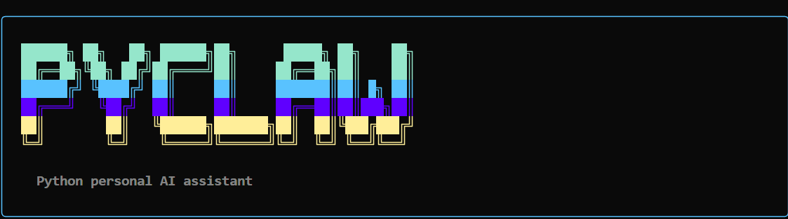

<p align="center">
  
</p>

<p align="center">
  <strong>Python personal AI assistant. Self-hosted. Open-source.</strong><br>
  CLI + Telegram + Discord + Slack.<br>
  Remembers you. Learns your ways. Plans and acts.
</p>

<p align="center">
  Built on <a href="https://github.com/langchain-ai/deepagents">LangChain Deep Agents SDK</a>
</p>

---

## What is PyClaw?

PyClaw is a self-hosted AI assistant that lives in your terminal and messaging apps. Unlike cloud-only assistants, PyClaw runs on your machine, stores memory locally, and connects to the LLM provider of your choice.

It is built on LangGraph's Deep Agents SDK — the same framework behind LangChain's coding agent — giving PyClaw access to file operations, shell commands, web search, task planning, and persistent memory out of the box.

**Key idea:** You configure PyClaw once with your identity, values, and preferences. It remembers conversations across sessions and can perform background tasks on a schedule.

## Features

- **Multi-provider LLM support** — OpenAI, Anthropic, Google Gemini, Ollama (local)
- **Interactive CLI** — REPL mode with streaming responses, or one-shot messages
- **Persistent memory** — Conversations are stored in SQLite; workspace `.md` files define the agent's personality and your preferences
- **Multi-platform chat** — Telegram, Discord, and Slack bot gateways, all routing through the same agent
- **Web search** — Tavily or DuckDuckGo integration for real-time information
- **Heartbeat scheduler** — APScheduler-based cron system so PyClaw can perform periodic tasks autonomously
- **Cross-channel messaging** — The agent can proactively send messages to you across platforms
- **Interactive onboarding** — First-run setup walks you through model selection and API key configuration
- **Workspace-driven personalization** — Five markdown files control the agent's identity, values, memory, user profile, and scheduled tasks

## Architecture

```
~/.pyclaw/
  config.json          # Model, tools, channels, heartbeat settings
  .env                 # API keys (created during onboarding)
  workspace/
    IDENTITY.md        # Who is PyClaw? (agent personality)
    SOUL.md            # Core values & communication style
    MEMORY.md          # Learned facts & preferences (updated by agent)
    USER.md            # Your profile
    HEARTBEAT.md       # Periodic background tasks
    sessions/
      checkpoints.sqlite   # Conversation history
    data/              # Agent workspace for file operations
```

```
src/pyclaw/
  cli.py               # Typer CLI — REPL, one-shot, onboarding, status
  agent.py             # Agent factory — LLM init, tools, prompt assembly
  config.py            # Pydantic config system
  prompts.py           # System prompt builder with workspace context
  workspace.py         # Template file initialization
  memory/loader.py     # Load .md files into agent context
  sessions/manager.py  # Thread IDs and SQLite checkpointer
  heartbeat/
    scheduler.py       # APScheduler periodic task runner
  tools/
    web_search.py      # Tavily / DuckDuckGo search
    cron_tool.py       # Agent-managed heartbeat tasks
    message.py         # Cross-channel messaging
  channels/
    base.py            # Abstract gateway base class
    telegram.py        # Telegram bot
    discord_ch.py      # Discord bot
    slack_ch.py        # Slack bot
```

## Quickstart

### Prerequisites

- Python 3.11+
- [uv](https://docs.astral.sh/uv/) (recommended) or pip

### Install and run

```bash
git clone https://github.com/rkvermaa/pyclaw.git
cd pyclaw
uv sync
uv run pyclaw
```

On first run, PyClaw will walk you through onboarding:

```
 ██████╗ ██╗   ██╗ ██████╗██╗      █████╗ ██╗    ██╗
 ██╔══██╗╚██╗ ██╔╝██╔════╝██║     ██╔══██╗██║    ██║
 ██████╔╝ ╚████╔╝ ██║     ██║     ███████║██║ █╗ ██║
 ██╔═══╝   ╚██╔╝  ██║     ██║     ██╔══██║██║███╗██║
 ██║        ██║   ╚██████╗███████╗██║  ██║╚███╔███╔╝
 ╚═╝        ╚═╝    ╚═════╝╚══════╝╚═╝  ╚═╝ ╚══╝╚══╝

  Python personal AI assistant

Choose your default model provider:
  1. OpenAI (gpt-4o)
  2. Anthropic (claude-sonnet-4-5-20250929)
  3. Google Gemini (gemini-2.0-flash)
  4. Ollama (llama3.2 - local, no API key needed)

Selection [1]: _
```

### CLI commands

```bash
pyclaw                    # Interactive REPL (auto-onboards on first run)
pyclaw -m "hello"         # One-shot message
pyclaw --model ollama:llama3.2   # Override model
pyclaw onboard            # Re-run onboarding (change model/key)
pyclaw status             # Show config summary
pyclaw cron list          # List heartbeat tasks
pyclaw cron start         # Start heartbeat scheduler
pyclaw gateway telegram   # Start Telegram bot
pyclaw gateway all        # Start all enabled channel bots
```

## Configuration

Edit `~/.pyclaw/config.json` to configure models, tools, channels, and heartbeat:

```json
{
  "default_model": "openai:gpt-4o",
  "tools": {
    "web_search": { "enabled": true, "provider": "tavily" },
    "shell_exec": { "enabled": true }
  },
  "channels": {
    "telegram": { "enabled": true, "token_env": "TELEGRAM_BOT_TOKEN" },
    "discord": { "enabled": false },
    "slack": { "enabled": false }
  },
  "heartbeat": { "enabled": false, "interval_minutes": 60 }
}
```

API keys are stored in `~/.pyclaw/.env`:

```
OPENAI_API_KEY=sk-...
TAVILY_API_KEY=tvly-...
TELEGRAM_BOT_TOKEN=123456:ABC...
```

## Personalize your agent

Edit the workspace markdown files at `~/.pyclaw/workspace/`:

| File | Purpose |
|------|---------|
| `IDENTITY.md` | Agent name, role, personality |
| `SOUL.md` | Core values, communication style |
| `USER.md` | Your name, preferences, context |
| `MEMORY.md` | Learned facts (agent updates this over time) |
| `HEARTBEAT.md` | Periodic tasks for the agent to perform |

## Roadmap

- [x] Core agent with LangChain Deep Agents SDK
- [x] Interactive CLI with streaming REPL
- [x] Multi-provider LLM support (OpenAI, Anthropic, Gemini, Ollama)
- [x] Persistent memory and session management
- [x] Interactive onboarding with API key setup
- [x] Web search tools (Tavily, DuckDuckGo)
- [x] Heartbeat scheduler for autonomous tasks
- [x] Telegram, Discord, Slack bot gateways
- [x] Cross-channel messaging tools
- [ ] WhatsApp gateway
- [ ] Voice mode (speech-to-text + text-to-speech)
- [ ] RAG over local documents
- [ ] Plugin system for custom tools
- [ ] Web UI dashboard
- [ ] Multi-agent collaboration
- [ ] Mobile companion app

## Contributing

PyClaw is in active development and open to contributors! If you're interested in building a personal AI assistant, check out the open issues or DM me on [LinkedIn](https://www.linkedin.com/in/ravi-kumar-verma-16837734/).

Areas where help is welcome:
- New channel integrations (WhatsApp, Line, etc.)
- Voice capabilities
- RAG / document ingestion
- UI / dashboard
- Testing and documentation

```bash
# Dev setup
git clone https://github.com/rkvermaa/pyclaw.git
cd pyclaw
uv sync --extra dev
uv run pytest -v
```

## License

MIT
